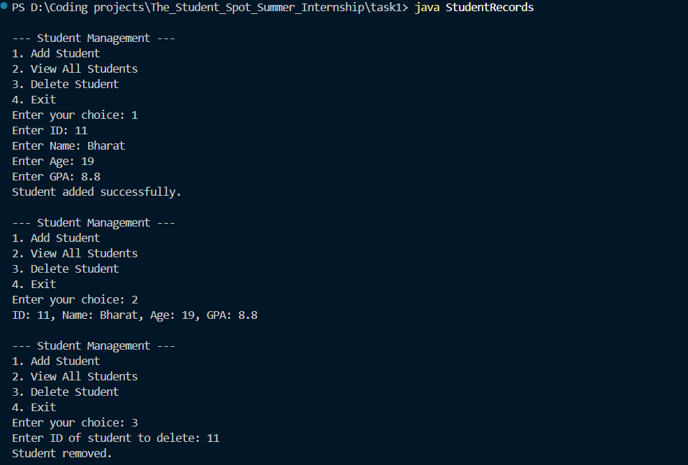

# Student Records Management in Java

This is a basic console-based Java program to manage student records using classes and objects. It allows users to add, view, and delete student records stored in memory using an `ArrayList`.

## 🚀 Features

- ✅ Add new student records
- ✅ View all student records
- ✅ Delete a student record by ID
- 🛑 Data is not persisted (cleared when program exits)

## 📦 Technologies Used

- Java
- OOP concepts (Classes, Objects)
- `ArrayList` for dynamic storage
- `Scanner` for user input

## 📄 Class Overview

### `Student`
Represents a single student record with:
- `id`: Student ID
- `name`: Student's full name
- `age`: Age
- `gpa`: Grade Point Average

### `StudentRecords`
Handles user interaction and student management operations:
- `addStudent()`: Adds a new student
- `viewStudents()`: Displays all students
- `deleteStudent()`: Deletes a student by ID

## 💻 How to Run

1. Make sure Java is installed.
2. Save the code in a file named `StudentRecords.java`.
3. Compile the file:
   ```bash
   javac StudentRecords.java
   ```
4. Run the file:
   ```bash
   java StudentRecords
   ```


## Sample output
