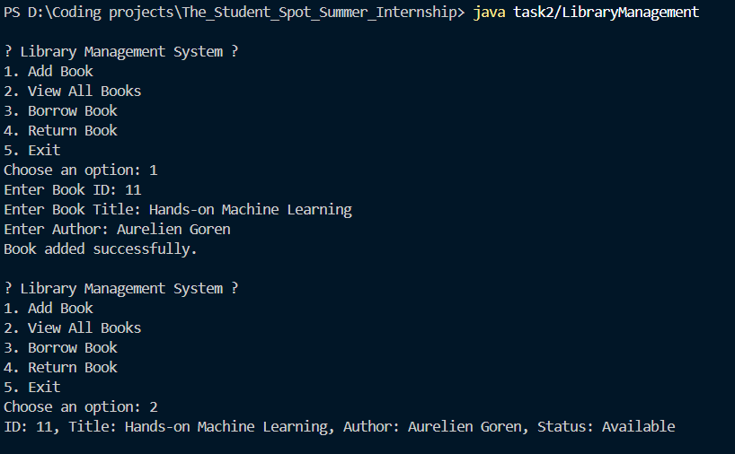

# 📚 Library Management System (Console-Based Java Project)

This is a **console-based mini-project** developed in Java that simulates a basic **Library Management System** using **Object-Oriented Programming (OOP)** principles. The system allows users to **add**, **view**, **borrow**, and **return** books.

---

## 🚀 Features

- ✅ Add new books to the library
- ✅ View all books with availability status
- ✅ Borrow a book by ID (if available)
- ✅ Return a borrowed book
- ❌ Data is **not persisted** (all data lost on exit)

---

## 🧠 Concepts Used

- Classes & Objects
- Encapsulation
- ArrayList (dynamic data structure)
- Conditional Logic & Loops
- User input handling with `Scanner`

---

## 📄 Class Structure

### 📘 `Book`
Represents a single book in the library.

Attributes:
- `id`: Unique identifier for each book
- `title`: Book name
- `author`: Author's name
- `isBorrowed`: Boolean flag to check if the book is borrowed

Methods:
- `display()`: Prints book details
- `borrow()`: Marks book as borrowed
- `returnBook()`: Marks book as available again

---

### 🏢 `LibraryManagement`
Handles:
- Menu navigation
- User interaction
- Operations on the book list

---

## 💻 How to Run

1. Save the Java code in a file named `LibraryManagement.java`.
2. Open a terminal or command prompt.
3. Compile the code:
   ```bash
   javac task2/LibraryManagement.java
   ```
4. Run the code:
   ```bash
   java task2/LibraryManagement
   ```

## Sample Output
