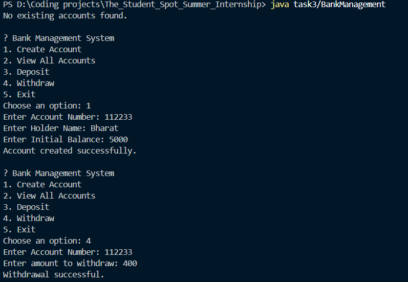

# 🏦 Bank Management System (Java Console App with File Handling)

This is a **simple bank management system** written in Java that uses **object-oriented programming** and **file handling** to store and manage customer bank accounts. It provides basic operations like creating an account, depositing, withdrawing, and viewing account details, all while ensuring **data persistence** through a text file.

---

## 🚀 Features

- ✅ Create new bank accounts
- ✅ View all existing accounts
- ✅ Deposit money into an account
- ✅ Withdraw money from an account
- ✅ Persistent storage using `accounts.txt` file

---

## 📂 File Structure

- `BankManagement.java` — Main Java program
- `accounts.txt` — Auto-generated file to store account data in CSV format

---

## 💡 Technologies Used

- Java
- File I/O (`BufferedReader`, `PrintWriter`)
- OOP (Classes, Encapsulation)
- ArrayList for account storage
- Console-based input with `Scanner`

---

## 🧠 Class Overview

### `BankAccount`

Represents a single customer’s bank account.  
**Fields:**
- `accountNumber`
- `holderName`
- `balance`

**Key Methods:**
- `deposit(amount)`
- `withdraw(amount)`
- `display()`
- `toFileString()` and `fromFileString()` for file I/O

---

### `BankManagement`

Main class with logic for:
- User interaction
- Menu-driven operations
- File reading/writing
- Account list management

---

## 📌 How to Run

1. **Save the code** in a file named `BankManagement.java`.
2. Open a terminal and **compile** the program:
   ```bash
   javac BankManagement.java
   ```
3. Run the program:
   ```bash
   java task3/BankManagement
   ```

## Sample output
